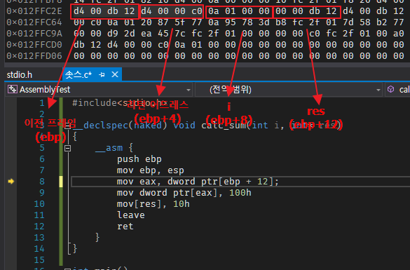

# 6/20

- 어젯밤 소쿠릿님의 [Ehnd4](https://github.com/sokcuri/Ehnd4/blob/master/src/CrashFix.cpp)를 보고 어셈블리에 갑자기 빠져서, 내일부터는 그동안 하고 싶었지만 도전하기 힘들었던 C/어셈블리 쪽의 로우레벨을 만져보자! 생각해서 오늘 시작했다.

    - 우선은 PC 어셈블리 번역본을 보면서 공부를 했는데 NASM 문법과 VC++에서 C 인라인 어셈블리로 돌리는거랑 문법의 차이는 역시 달라서 SNS와 구글의 힘을 많이 믿었다.

    - 세그먼트, 스택 프레임과 메모리 구조쪽 이해가 많이 어려웠다. 하지만 갓-IDE Visual Studio의 힘을 빌려 꽤 많은 삽질을 통해 해냈다.

    

- 로우레벨 만세다 만세